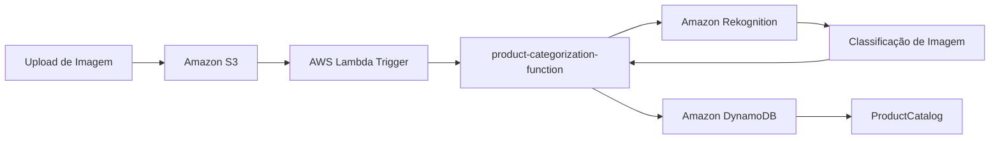

# 🛒 Automating E-commerce Product Categorization with Amazon Rekognition and AWS Lambda

## 📋 Visão Geral

Este desafio apresenta uma solução completa de **categorização automática de produtos** para e-commerce usando AWS. O sistema processa imagens de produtos, classifica automaticamente usando IA e armazena os resultados em uma base de dados.

## 🎯 Objetivos de Aprendizado

- Configurar triggers S3 para AWS Lambda
- Debuggar e otimizar funções Lambda
- Integrar Amazon Rekognition para classificação de imagens
- Monitorar execução via CloudWatch Logs
- Armazenar resultados em DynamoDB
- Resolver problemas comuns de timeout e permissões

## 🛠️ Arquitetura da Solução

## 🔧 Tecnologias Utilizadas

- **Amazon S3** - Armazenamento de imagens de produtos
- **AWS Lambda** - Processamento serverless das imagens
- **Amazon Rekognition** - Classificação automática de imagens usando IA
- **Amazon DynamoDB** - Armazenamento dos resultados de categorização
- **CloudWatch Logs** - Monitoramento e debugging

## 📚 Estrutura do Desafio

### [Task 1: Troubleshooting AWS Lambda Triggers](./task1.md)
- Identificar e acessar bucket S3
- Configurar trigger S3 → Lambda
- Resolver problemas de permissões
- Testar upload e execução

### [Task 2: Debugging Lambda Function Errors](./task2.md)
- Resolver timeouts de execução
- Otimizar configurações de memória e CPU
- Monitorar execução via CloudWatch
- Validar pipeline completo

### [Task 3: Configuring Test Events](./task3.md)
- Testar pipeline end-to-end
- Validar classificação no Rekognition
- Verificar gravação no DynamoDB
- Submeter resultados finais

## 🚀 Pré-requisitos

- Conta AWS com acesso aos serviços necessários
- Permissões para S3, Lambda, Rekognition e DynamoDB
- Conhecimento básico de AWS Console
- Imagens de produtos para teste

## 📖 Conceitos Importantes

### Amazon Rekognition
Serviço de IA que analisa imagens e vídeos para identificar objetos, pessoas, texto, cenas e atividades.

### AWS Lambda Triggers
Eventos que disparam a execução de funções Lambda automaticamente, como uploads no S3.

### DynamoDB
Banco de dados NoSQL gerenciado para aplicações que precisam de latência baixa e consistente.

### CloudWatch Logs
Serviço de monitoramento que coleta e armazena logs de aplicações e serviços AWS.

## 🎮 Cenário do Desafio

Sistema de e-commerce que precisa categorizar automaticamente produtos baseado em suas imagens. Quando uma nova imagem é enviada para o S3, o sistema:

1. **Detecta** o upload via trigger
2. **Processa** a imagem no Lambda
3. **Classifica** usando Rekognition
4. **Armazena** o resultado no DynamoDB

## ⚠️ Problemas Comuns e Soluções

### Bucket não aparece na lista
- **Causa**: Falta de permissão `s3:ListAllMyBuckets`
- **Solução**: Acessar diretamente pelo nome/ARN do bucket

### Timeout de Lambda
- **Causa**: Processamento de imagens complexas demora muito
- **Solução**: Aumentar timeout para 15 minutos (máximo)

### Permissões insuficientes
- **Causa**: Configurações de lab com permissões limitadas
- **Solução**: Focar apenas nas funcionalidades necessárias

## ✅ Resultados Esperados

Ao final deste desafio, você terá:
- Sistema funcional de categorização automática
- Pipeline S3 → Lambda → Rekognition → DynamoDB
- Experiência com debugging de Lambda
- Conhecimento sobre triggers e monitoramento

## 🔗 Links Úteis

- [Amazon Rekognition Documentation](https://docs.aws.amazon.com/rekognition/)
- [AWS Lambda Developer Guide](https://docs.aws.amazon.com/lambda/)
- [Amazon S3 User Guide](https://docs.aws.amazon.com/s3/)
- [DynamoDB Developer Guide](https://docs.aws.amazon.com/dynamodb/)
- [CloudWatch Logs User Guide](https://docs.aws.amazon.com/cloudwatch/)

## 🏷️ Tags

**Categoria**: AI/ML, Serverless, E-commerce  
**Nível**: Iniciante  
**Duração**: 1-2 horas  
**Serviços**: S3, Lambda, Rekognition, DynamoDB, CloudWatch

---

**Dica**: Este desafio é excelente para entender como integrar diferentes serviços AWS em uma solução de IA prática para e-commerce!
