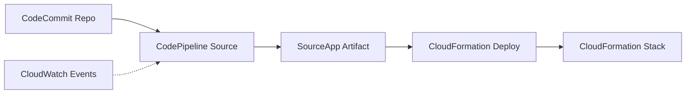

# 🔧 CodePipeline Not Working

## 📋 Visão Geral

Este desafio apresenta uma experiência prática de **troubleshooting** de um pipeline AWS CodePipeline que está em estado de falha. Você aprenderá a diagnosticar problemas comuns, corrigir configurações incorretas e restaurar a funcionalidade de um pipeline CI/CD.

## 🎯 Objetivos de Aprendizado

- Diagnosticar falhas em pipelines CodePipeline
- Corrigir configurações de Source e Deploy stages
- Resolver problemas de permissões IAM
- Ajustar caminhos de arquivos em CloudFormation
- Configurar change detection options adequadamente
- Executar troubleshooting sistemático de CI/CD

## 🛠️ Tecnologias Utilizadas

- **AWS CodePipeline** - Serviço de CI/CD
- **AWS CodeCommit** - Repositório de código-fonte
- **AWS CloudFormation** - Infraestrutura como código
- **Amazon CloudWatch Events** - Detecção de mudanças
- **AWS IAM** - Gerenciamento de permissões

## 📚 Estrutura do Desafio

### [Task 1: Troubleshooting & Fix](./task1.md)
- Diagnosticar falha no pipeline CodePipeline
- Identificar problema de arquivo inexistente
- Corrigir configurações de Source e Deploy stages
- Resolver problemas de permissões IAM
- Executar pipeline corrigido com sucesso

## 🏗️ Arquitetura da Solução



## 🔧 Problemas Identificados

### ❌ Erro Principal
```
File [template.yaml] does not exist in artifact [SourceApp]
```

### 🔍 Causa Raiz
- **Source stage** produzia artifact `SourceApp`
- **Deploy stage** procurava arquivo `template.yaml`
- **Arquivo real** estava em `infrastructure-as-code/working.template.yaml`
- **Mismatch** entre configuração e estrutura real

### ⚠️ Problemas Secundários
- **Permissões IAM**: Falha ao criar role `cwe-role`
- **Change Detection**: Configuração inadequada
- **Capabilities**: Permissões CloudFormation insuficientes

## 🛠️ Soluções Implementadas

### 1. Source Stage
- **Repository**: `challenge-codecommit`
- **Branch**: Branch padrão (main)
- **Output artifacts**: `SourceApp`
- **Change detection**: AWS CodePipeline (polling)

### 2. Deploy Stage
- **Input artifacts**: `SourceApp`
- **Template file**: `infrastructure-as-code/working.template.yaml`
- **Capabilities**: `CAPABILITY_IAM` e `CAPABILITY_NAMED_IAM`
- **Stack name**: `PipelineStack`

### 3. Permissões
- **Evitar criação de role**: Usar polling em vez de CloudWatch Events
- **Capabilities CloudFormation**: Habilitar permissões necessárias

## 🚀 Pré-requisitos

- Conta AWS com acesso ao CodePipeline
- Permissões para CodeCommit, CloudFormation e IAM
- Conhecimento básico de CI/CD
- Pipeline existente em estado de falha

## 📖 Conceitos Importantes

### CodePipeline Artifacts
- **SourceApp**: Artifact produzido pelo Source stage
- **Consistência**: Nomes devem coincidir entre stages
- **Estrutura**: Arquivos devem existir no caminho especificado

### CloudFormation Templates
- **Caminho relativo**: Baseado no artifact
- **Capabilities**: Permissões necessárias para recursos
- **Stack name**: Identificador único da stack

### Change Detection
- **CloudWatch Events**: Requer role IAM específica
- **CodePipeline Polling**: Alternativa mais simples
- **Polling frequency**: Verificação periódica de mudanças

## ⚠️ Problemas Comuns

### Arquivo Não Encontrado
- **Causa**: Caminho incorreto no template file
- **Solução**: Verificar estrutura real do repositório
- **Prevenção**: Validar caminhos antes de salvar

### Permissões IAM
- **Causa**: Falta de permissão para criar roles
- **Solução**: Usar polling em vez de CloudWatch Events
- **Alternativa**: Solicitar permissões adequadas

### Capabilities CloudFormation
- **Causa**: Recursos que criam IAM roles
- **Solução**: Habilitar CAPABILITY_IAM
- **Validação**: Verificar template para recursos IAM

## ✅ Resultados Esperados

Ao final deste desafio, você terá:
- Pipeline CodePipeline funcionando corretamente
- Conhecimento de troubleshooting de CI/CD
- Experiência com correção de configurações
- Entendimento de permissões e capabilities
- Habilidade para diagnosticar problemas similares

## 🔗 Links Úteis

- [AWS CodePipeline Documentation](https://docs.aws.amazon.com/codepipeline/)
- [CodePipeline Troubleshooting Guide](https://docs.aws.amazon.com/codepipeline/latest/userguide/troubleshooting.html)
- [CloudFormation Capabilities](https://docs.aws.amazon.com/AWSCloudFormation/latest/UserGuide/using-iam-template.html)
- [CodeCommit User Guide](https://docs.aws.amazon.com/codecommit/)

## 🏷️ Tags

**Categoria**: DevOps, CI/CD, Troubleshooting  
**Nível**: Iniciante  
**Duração**: 30-45 minutos  
**Serviços**: CodePipeline, CodeCommit, CloudFormation, IAM

---

**Dica**: Este desafio é excelente para desenvolver habilidades de troubleshooting em ambientes CI/CD reais!
