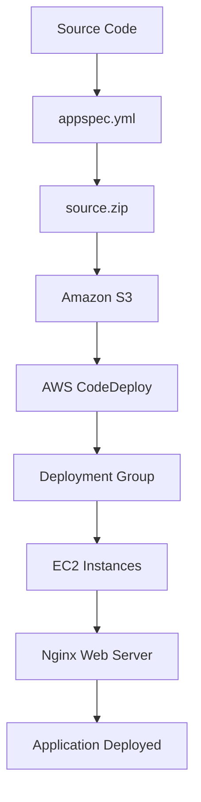

# 🚀 Developing Deployments

## 📋 Visão Geral

Este desafio apresenta uma introdução prática ao **AWS CodeDeploy**, um serviço de deployment automatizado que facilita o lançamento de aplicações em instâncias EC2. Você aprenderá a criar artefatos de deploy, configurar aplicações e executar deployments automatizados.

## 🎯 Objetivos de Aprendizado

- Criar arquivos `appspec.yml` válidos para CodeDeploy
- Configurar aplicações e deployment groups
- Entender lifecycle hooks do CodeDeploy
- Executar deployments automatizados
- Monitorar e validar deployments

## 🛠️ Tecnologias Utilizadas

- **AWS CodeDeploy** - Serviço de deployment automatizado
- **Amazon S3** - Armazenamento de artefatos de deploy
- **Amazon EC2** - Instâncias de destino
- **Auto Scaling Groups** - Gerenciamento de instâncias
- **Nginx** - Servidor web para demonstração

## 📚 Estrutura do Desafio

### [Task 1: Preparar o Artefato de Deploy](./task1.md)
- Criar arquivo `appspec.yml` válido
- Configurar lifecycle hooks (ApplicationStop, BeforeInstall, ApplicationStart)
- Preparar pacote `source.zip` para S3
- Upload do artefato para bucket S3

### [Task 2: Criar Aplicação e Deployment Group](./task2.md)
- Criar aplicação CodeDeploy (`jam-app`)
- Configurar deployment group (`jam`)
- Configurar deployment type (In-place)
- Configurar rollback automático

### [Task 3: Executar Deployment](./task3.md)
- Criar deployment usando artefato do S3
- Configurar opções de overwrite
- Monitorar progresso do deployment
- Validar resultado final

## 🏗️ Arquitetura da Solução



## 🔧 Conceitos Importantes

### AWS CodeDeploy
Serviço que automatiza deployments de aplicações para instâncias EC2, servidores on-premises ou serviços serverless.

### Lifecycle Hooks
Etapas do processo de deployment:
- **ApplicationStop**: Para a aplicação atual
- **BeforeInstall**: Prepara o ambiente
- **Install**: Copia arquivos (gerenciado pelo CodeDeploy)
- **ApplicationStart**: Inicia a nova aplicação

### appspec.yml
Arquivo de especificação que define:
- Onde copiar arquivos
- Quais scripts executar
- Configurações de timeout e usuário

## 🚀 Pré-requisitos

- Conta AWS com acesso ao CodeDeploy
- Permissões para S3, EC2 e CodeDeploy
- Conhecimento básico de AWS Console
- Arquivo source.zip fornecido no desafio

## 📖 Estrutura do Artefato

```
source.zip
├── appspec.yml          # Especificação do CodeDeploy
└── deploy/              # Scripts de deployment
    ├── applicationstop.sh
    ├── before.sh
    ├── applicationstart.sh
    └── index.html
```

## ⚠️ Pontos Importantes

### Estrutura do appspec.yml
- **Arquivo na raiz**: `appspec.yml` deve estar no nível superior do ZIP
- **Destino**: Arquivos copiados para `/opt/codedeploy/`
- **Hooks**: Não usar hook `Install` (gerenciado pelo CodeDeploy)
- **Permissões**: Scripts executados como `root`

### Configurações de Deployment
- **Tipo**: In-place (atualiza instâncias existentes)
- **Estratégia**: One-at-a-time (uma instância por vez)
- **Rollback**: Habilitado para falhas
- **Overwrite**: Substitui arquivos existentes

## ✅ Resultados Esperados

Ao final deste desafio, você terá:
- Artefato de deploy funcional no S3
- Aplicação CodeDeploy configurada
- Deployment group com rollback automático
- Aplicação web funcionando nas instâncias EC2
- Conhecimento prático de CodeDeploy

## 🔗 Links Úteis

- [AWS CodeDeploy Documentation](https://docs.aws.amazon.com/codedeploy/)
- [CodeDeploy AppSpec File Reference](https://docs.aws.amazon.com/codedeploy/latest/userguide/reference-appspec-file.html)
- [CodeDeploy Lifecycle Events](https://docs.aws.amazon.com/codedeploy/latest/userguide/reference-appspec-file-structure-hooks.html)
- [CodeDeploy Deployment Groups](https://docs.aws.amazon.com/codedeploy/latest/userguide/deployment-groups.html)

## 🏷️ Tags

**Categoria**: DevOps, Deployment, EC2  
**Nível**: Iniciante  
**Duração**: 1-2 horas  
**Serviços**: CodeDeploy, S3, EC2, Auto Scaling

---

**Dica**: Este desafio é excelente para entender como automatizar deployments em ambientes EC2 usando AWS CodeDeploy!
