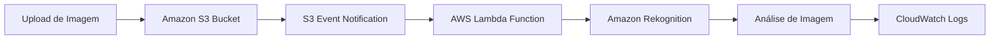

# 🚀 Foundational Serverless - Connecting S3 events

## 📋 Visão Geral

Este desafio apresenta uma introdução prática ao **serverless computing** na AWS, focando na integração entre **Amazon S3** e **AWS Lambda** para processamento automático de imagens. Você aprenderá a configurar eventos S3, conectar com funções Lambda e implementar processamento automático usando **Amazon Rekognition**.

## 🎯 Objetivos de Aprendizado

- Criar e configurar buckets S3 para eventos
- Configurar notificações de eventos S3
- Conectar S3 com AWS Lambda automaticamente
- Implementar processamento de imagens com Rekognition
- Monitorar execução via CloudWatch Logs
- Entender arquitetura serverless event-driven

## 🛠️ Tecnologias Utilizadas

- **Amazon S3** - Armazenamento de imagens e documentos
- **AWS Lambda** - Processamento serverless
- **Amazon Rekognition** - Análise de imagens com IA
- **CloudWatch Logs** - Monitoramento e debugging
- **S3 Event Notifications** - Triggers automáticos

## 📚 Estrutura do Desafio

### [Task 1: Criar Bucket S3](./task1.md)
- Criar bucket S3 para ingestão de imagens
- Configurar configurações de segurança
- Preparar bucket para integração com Lambda
- Definir nome e região adequados

### [Task 2: Conectar os Pontos](./task2.md)
- Configurar evento de notificação S3
- Conectar bucket com função Lambda
- Testar upload e processamento automático
- Validar integração completa

## 🏗️ Arquitetura da Solução

## 🔧 Conceitos Importantes

### S3 Event Notifications
- **Trigger automático**: Dispara Lambda quando objetos são criados
- **Event types**: `s3:ObjectCreated:*` para todos os tipos de criação
- **Destination**: Lambda function específica
- **Real-time**: Processamento imediato após upload

### AWS Lambda Integration
- **Event-driven**: Executa apenas quando necessário
- **Serverless**: Sem gerenciamento de infraestrutura
- **Scalable**: Ajusta automaticamente à demanda
- **Cost-effective**: Paga apenas pelo tempo de execução

### Amazon Rekognition
- **IA para imagens**: Análise automática de conteúdo
- **Detecção de objetos**: Identifica elementos na imagem
- **Labels**: Categorização automática
- **Confidence scores**: Níveis de confiança das detecções

## 🚀 Pré-requisitos

- Conta AWS com acesso aos serviços necessários
- Permissões para S3, Lambda e Rekognition
- Conhecimento básico de AWS Console
- Função Lambda pré-configurada (RekogLambda)

## 📖 Estrutura do Sistema

### Fluxo de Dados
1. **Upload** de imagem para bucket S3
2. **Event notification** detecta novo objeto
3. **Lambda function** é acionada automaticamente
4. **Rekognition** analisa a imagem
5. **Resultados** são processados e logados
6. **CloudWatch** registra execução completa

### Configurações de Segurança
- **Block all public access**: Habilitado por padrão
- **ACLs desativadas**: Controle de acesso via IAM
- **Versioning**: Desabilitado (padrão)
- **Encryption**: Configurações padrão de segurança

## ⚠️ Pontos Importantes

### Nomenclatura do Bucket
- **Nome único**: Deve ser globalmente único
- **Convenção**: Incluir data/hora para unicidade
- **Exemplo**: `da-rekognition-16-09-2025-19-47`

### Configuração de Eventos
- **Event name**: Identificador único do evento
- **Event type**: `All object create events`
- **Destination**: Lambda function específica
- **Teste**: Upload de arquivo para validação

### Monitoramento
- **CloudWatch Logs**: Verificar execução da Lambda
- **S3 Console**: Confirmar upload e eventos
- **Lambda Console**: Monitorar invocações

## ✅ Resultados Esperados

Ao final deste desafio, você terá:
- Bucket S3 configurado para eventos
- Integração S3 → Lambda funcionando
- Processamento automático de imagens
- Sistema serverless event-driven
- Conhecimento prático de arquitetura serverless

## 🔗 Links Úteis

- [Amazon S3 Event Notifications](https://docs.aws.amazon.com/s3/latest/userguide/NotificationHowTo.html)
- [AWS Lambda with S3](https://docs.aws.amazon.com/lambda/latest/dg/with-s3.html)
- [Amazon Rekognition Documentation](https://docs.aws.amazon.com/rekognition/)
- [CloudWatch Logs User Guide](https://docs.aws.amazon.com/cloudwatch/)

## 🏷️ Tags

**Categoria**: Serverless, Event-Driven, IA/ML  
**Nível**: Iniciante  
**Duração**: 30-45 minutos  
**Serviços**: S3, Lambda, Rekognition, CloudWatch

---

**Dica**: Este desafio é excelente para entender como construir aplicações serverless event-driven na AWS!
