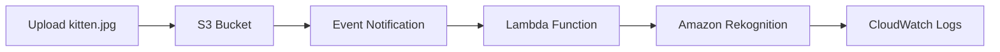

# 📌 Task 2: Conectar os Pontos

## 🎯 Objetivo

Configurar evento de notificação S3 para acionar automaticamente a função Lambda e testar o processamento automático de imagens com Amazon Rekognition.

## 🛠️ Atividade Realizada

### 1. Acesso ao Bucket S3

#### Bucket de Destino
- **Nome**: `da-rekognition-16-09-2025-19-47`
- **Criado em**: Task 1
- **Status**: Pronto para configuração de eventos

### 2. Configuração de Evento de Notificação

#### Configurações do Evento
- **Event name**: `trigger-rekoglambda`
- **Event type**: `All object create events (s3:ObjectCreated:*)`
- **Destination**: `Lambda function → RekogLambda...`

#### Detalhes da Configuração
| Parâmetro | Valor | Descrição |
|-----------|-------|-----------|
| **Event name** | `trigger-rekoglambda` | Identificador único do evento |
| **Event type** | `s3:ObjectCreated:*` | Todos os tipos de criação de objeto |
| **Destination** | `Lambda function` | Tipo de destino |
| **Function** | `RekogLambda...` | Função Lambda específica |

### 3. Teste de Upload

#### Arquivo de Teste
- **Arquivo**: `kitten.jpg`
- **Local**: Raiz do bucket
- **Tipo**: Imagem para processamento com Rekognition

#### Processo de Teste
1. **Upload** do arquivo para o bucket S3
2. **Event notification** detecta novo objeto
3. **Lambda function** é acionada automaticamente
4. **Rekognition** processa a imagem
5. **Logs** são gerados no CloudWatch

## 🔄 Fluxo de Processamento

### Sequência de Eventos


### Detalhamento do Processo
1. **Upload**: Arquivo enviado para bucket S3
2. **Trigger**: Event notification detecta `s3:ObjectCreated:*`
3. **Invoke**: Lambda function `RekogLambda...` é acionada
4. **Process**: Rekognition analisa a imagem
5. **Log**: Resultados registrados no CloudWatch

## 📊 Resultado Esperado

### Processamento Automático
- ✅ **Upload no bucket** disparou o evento
- ✅ **Lambda function** foi acionada automaticamente
- ✅ **Imagem processada** no Amazon Rekognition
- ✅ **Logs de execução** disponíveis no CloudWatch

### Validação
- **CloudWatch Logs**: Verificar execução da função RekogLambda
- **JAM Validation**: Clicar em "Check my progress"
- **Status**: Integração completa validada

## 🔍 Monitoramento e Logs

### CloudWatch Logs
- **Grupo**: `/aws/lambda/RekogLambda...`
- **Stream**: Log stream da execução
- **Conteúdo**: Detalhes do processamento Rekognition

### Logs Esperados
```bash
# Exemplo de logs esperados
START RequestId: xxx-xxx-xxx
Processing image: s3://bucket/kitten.jpg
Detected labels: [Cat, Animal, Pet, Kitten]
Confidence scores: [0.99, 0.95, 0.87, 0.82]
END RequestId: xxx-xxx-xxx
```

## ✅ Status Final

### Integração Completa
- ✅ **S3 → Lambda → Rekognition** configurada
- ✅ **Event notification** funcionando
- ✅ **Processamento automático** validado
- ✅ **Task 2 concluída** com sucesso

### Validação Automática
- **JAM Platform**: Validação confirmada
- **Check my progress**: Status aprovado
- **Sistema funcional**: Pronto para uso

## 🔧 Conceitos Aplicados

### Event-Driven Architecture
- **S3 Events**: Triggers automáticos
- **Lambda Functions**: Processamento serverless
- **Rekognition**: IA para análise de imagens
- **CloudWatch**: Monitoramento e logs

### Serverless Benefits
- **Sem infraestrutura**: Gerenciamento automático
- **Escalabilidade**: Ajuste automático à demanda
- **Custo-efetivo**: Paga apenas pelo uso
- **Disponibilidade**: Alta disponibilidade nativa

## 🔗 Próximos Passos

Com a integração S3 → Lambda → Rekognition funcionando, você pode:
- **Expandir processamento** para outros tipos de arquivo
- **Implementar filtros** de eventos mais específicos
- **Adicionar notificações** para outros serviços
- **Monitorar métricas** de uso e performance

## 💡 Lições Aprendidas

- **Event-driven architecture** facilita integração entre serviços
- **S3 event notifications** são poderosas para automação
- **Lambda functions** processam eventos de forma eficiente
- **Rekognition** oferece análise de IA sem complexidade
- **CloudWatch** é essencial para monitoramento