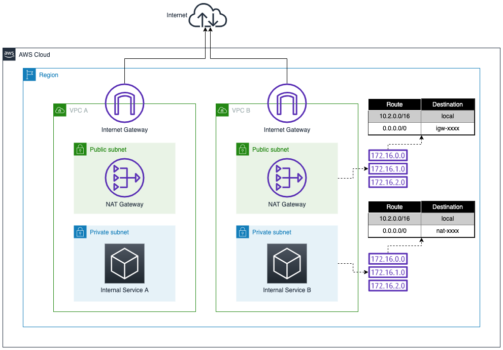

# Task 1: Design - Identificando o Padrão Arquitetural

**Pontos Possíveis:** 15  
**Penalidade de Dica:** 0  
**Pontos Disponíveis:** 15

---

## 📖 Background

Uma ocorrência comum ao arquitetar na nuvem é que existe um padrão que pode ser seguido para alguns recursos, mas quando o número de recursos cresce, outro padrão pode ter melhor escala, reduzindo o overhead de gerenciamento (**Operational Excellence**), melhorando a resiliência, segurança e/ou reduzindo custos.

Seu ambiente possui duas VPCs para recursos internos e mais VPCs estão planejadas para as próximas semanas para suportar outros serviços internos. Esses recursos não são públicos, são apenas para acesso interno, mas alguns ainda precisam de acesso à Internet para se conectar a outros serviços de terceiros.

### 🔴 Preocupações da Equipe de Segurança

A equipe de segurança está satisfeita que o design proposto isola essas diferentes cargas de trabalho, mas está levantando preocupações sobre:
- Monitorar e proteger **múltiplos pontos de acesso à Internet**
- A **superfície de ataque continua crescendo** conforme você adiciona mais serviços

### 💰 Preocupações da Equipe de Finanças

A equipe de finanças está levantando preocupações sobre o custo de uma estratégia de múltiplas VPCs que, após análise adicional, é o custo de **múltiplos NAT Gateways** (um por zona de disponibilidade) **por VPC**.

## 🎯 Sua Tarefa

Você consegue propor uma arquitetura multi-VPC que aborde **ambas as preocupações** de segurança e custo?

## 📚 Getting Started

Neste desafio, queremos criar um **ponto único de saída para Internet** a partir de múltiplas VPCs. Existem vários blogs e whitepapers que discutem soluções para isso, incluindo:

### 📖 Recursos Recomendados

1. **[Creating a single internet exit point from multiple VPCs Using AWS Transit Gateway](https://aws.amazon.com/blogs/networking-and-content-delivery/creating-a-single-internet-exit-point-from-multiple-vpcs-using-aws-transit-gateway/)**
   - Blog oficial da AWS
   - Explica o padrão completo
   - Inclui diagramas de arquitetura

2. **[Building an egress VPC with AWS Transit Gateway and the AWS CDK](https://aws.amazon.com/blogs/developer/building-an-egress-vpc-with-aws-transit-gateway-and-the-aws-cdk/)**
   - Implementação com Infrastructure as Code
   - Exemplo prático com AWS CDK

3. **[Building a Scalable and Secure Multi-VPC AWS Network Infrastructure](https://aws.amazon.com/blogs/architecture/building-a-scalable-and-secure-multi-vpc-aws-network-infrastructure/)**
   - Arquitetura escalável
   - Melhores práticas de segurança

## 📦 Inventário

Explore o console da VPC para ver que duas VPCs já estão em uso, ambas com sub-redes públicas e privadas, ambas com um recurso na sub-rede privada.

### Ambiente de Rede Implantado



**Estrutura atual:**

```
┌─────────────────────────────┐       ┌─────────────────────────────┐
│         VPC A               │       │         VPC B               │
│      (10.1.0.0/16)          │       │      (10.2.0.0/16)          │
├─────────────────────────────┤       ├─────────────────────────────┤
│                             │       │                             │
│  ┌─────────────────────┐   │       │  ┌─────────────────────┐   │
│  │  Public Subnet      │   │       │  │  Public Subnet      │   │
│  │  - NAT Gateway      │   │       │  │  - NAT Gateway      │   │
│  │  - Internet Gateway │   │       │  │  - Internet Gateway │   │
│  └─────────────────────┘   │       │  └─────────────────────┘   │
│                             │       │                             │
│  ┌─────────────────────┐   │       │  ┌─────────────────────┐   │
│  │  Private Subnet     │   │       │  │  Private Subnet     │   │
│  │  - Internal Service │   │       │  │  - Internal Service │   │
│  └─────────────────────┘   │       │  └─────────────────────┘   │
│                             │       │                             │
└──────────┬──────────────────┘       └──────────┬──────────────────┘
           │                                     │
           └──────────► INTERNET ◄───────────────┘
              (Múltiplos pontos de saída)
```

### ⚠️ Notas Importantes

- **Única AZ:** Ambas as VPCs foram configuradas para usar uma única zona de disponibilidade para simplificar este desafio. Isso **não é melhor prática**, mas usar múltiplas zonas de disponibilidade não é relevante para este desafio e evita muito trabalho repetitivo.

- **Default VPC:** Não use ou modifique a VPC padrão neste desafio.

## ✅ Validação da Tarefa

Este padrão para reduzir os pontos de acesso à Internet em uma configuração multi-VPC agora é comumente conhecido como o padrão **________** VPC. 

**Insira o nome do padrão para completar esta tarefa.**

---

## 💡 Dicas para Resolução

### 🔍 O Que Procurar nos Blogs

Ao ler os recursos recomendados, preste atenção em:

1. **Nome do Padrão**
   - Como esse padrão arquitetural é chamado?
   - Qual termo é mais usado na comunidade AWS?

2. **Componentes Principais**
   - Que serviços AWS são usados?
   - Como as VPCs se conectam?
   - Onde fica o NAT Gateway?

3. **Fluxo de Tráfego**
   - Como o tráfego sai das VPCs de workload?
   - Por onde passa antes de chegar à Internet?
   - Como o tráfego retorna?

4. **Benefícios**
   - Economia de custos: como é alcançada?
   - Segurança: quais melhorias?
   - Operação: como simplifica?

### 🎯 Conceitos-Chave

#### Centralização de Saída
O padrão envolve criar uma VPC dedicada especificamente para gerenciar o tráfego de **saída (egress)** para a Internet.

#### Hub-and-Spoke
As VPCs de workload (spoke) se conectam a um hub central que gerencia a conectividade.

#### Consolidação de Recursos
Em vez de ter recursos de rede em cada VPC, consolida-se em uma única VPC:
- ✅ Um conjunto de NAT Gateways
- ✅ Um Internet Gateway
- ✅ Pontos de inspeção de tráfego
- ✅ Controles de segurança

## 🧩 Arquitetura Desejada (Conceitual)

```
        VPC A              VPC B           VPC C (futura)
       (spoke)            (spoke)             (spoke)
          │                  │                   │
          └──────────┬───────┴──────┬────────────┘
                     │              │
                     ▼              ▼
              ┌──────────────────────────┐
              │    Hub Central           │
              │  (Roteador de rede)      │
              └────────────┬─────────────┘
                           │
                           ▼
                ┌──────────────────────┐
                │   VPC ???            │
                │   (Ponto único de    │
                │    saída/egress)     │
                ├──────────────────────┤
                │ • NAT Gateway        │
                │ • Internet Gateway   │
                │ • Firewall (opt.)    │
                └──────────┬───────────┘
                           │
                           ▼
                       Internet
```

## 📝 Resposta

Depois de ler os recursos e entender o padrão, a resposta é uma única palavra que descreve o tipo de VPC usada para centralizar a saída para Internet.

---

## ✅ Solução

<details>
<summary><strong>🔑 Clique para ver a resposta</strong></summary>

### Resposta: **Egress**

O padrão é chamado de **Egress VPC Pattern**.

### 📚 Explicação

**Egress** significa "saída" em inglês. Uma **Egress VPC** é uma VPC dedicada especificamente para gerenciar o tráfego de **saída** de múltiplas VPCs para a Internet.

### Componentes do Padrão

1. **Egress VPC:** VPC dedicada com NAT Gateway e Internet Gateway
2. **Transit Gateway:** Hub central que conecta todas as VPCs
3. **Spoke VPCs:** VPCs de workload (A, B, C, etc.)
4. **Roteamento:** Configurado para direcionar tráfego de saída através da Egress VPC

### Benefícios

- 💰 **Custo:** Reduz número de NAT Gateways
- 🔒 **Segurança:** Ponto único de monitoramento e controle
- 🛡️ **Inspeção:** Facilita implementação de firewalls e IDS/IPS
- 📊 **Observabilidade:** Logs centralizados de tráfego de saída
- 🔧 **Operação:** Gerenciamento simplificado

</details>

---

## 🎯 Checklist de Conclusão

- [ ] Li pelo menos um dos blogs recomendados
- [ ] Entendi o conceito de Egress VPC
- [ ] Identifiquei o nome do padrão
- [ ] Compreendi os benefícios de custo e segurança
- [ ] Entendi o papel do Transit Gateway
- [ ] Submeti a resposta correta

---

**Próximo passo:** Task 2 - Implementar a Egress VPC! 🚀
