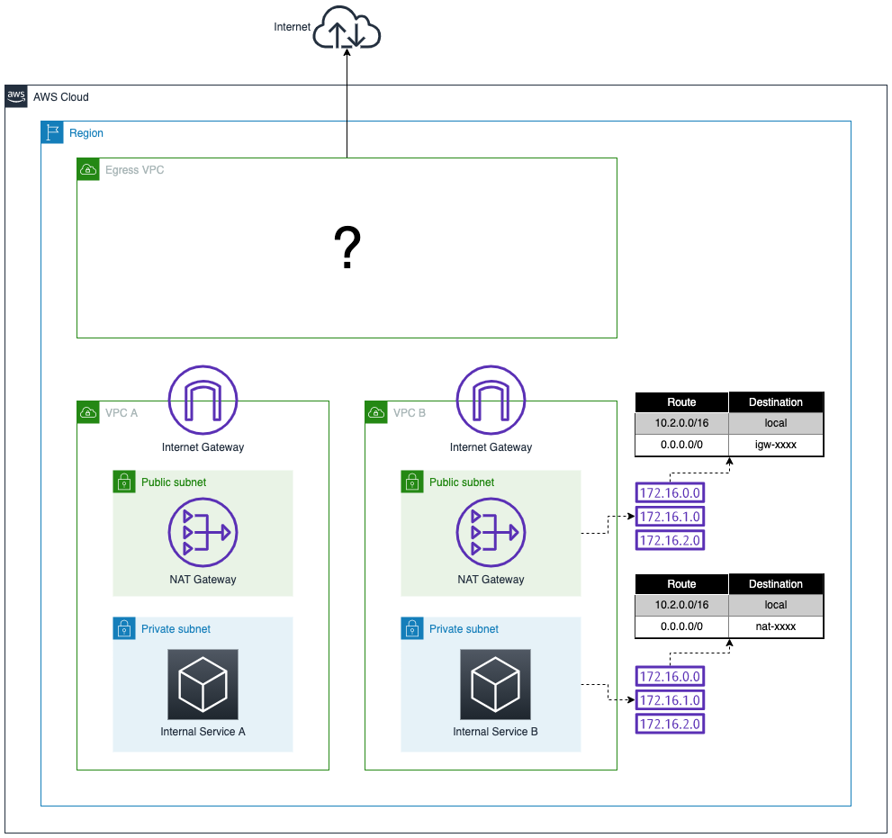

# Task 2: Deploy - Criando a Egress VPC

**Pontos Possíveis:** 30  
**Penalidade de Dica:** 0  
**Pontos Disponíveis:** 30

---

## 📖 Background

Após revisar os blogs sobre o padrão Egress VPC, você decide implementá-lo em seu ambiente antes que mais VPCs com seus serviços sejam implantadas.

## 🎯 Sua Tarefa

O primeiro passo na implantação do padrão Egress VPC será **criar a Egress VPC**. Na próxima tarefa, configuraremos o roteamento entre as VPCs.

## 📚 Getting Started

Considere quais recursos você vai precisar na Egress VPC:

### 🤔 Perguntas Para Responder

1. **Qual bloco CIDR usar?**
   - Se estamos roteando tráfego das outras duas VPCs, os blocos CIDR não podem se sobrepor
   - Lembre-se: o plano é adicionar ainda mais VPCs, então usar um bloco bem diferente faz sentido
   - **Sugestão:** `10.200.0.0/16` (bem diferente de 10.1/16 e 10.2/16)

2. **Quantas sub-redes?**
   - Como as VPCs existentes, implante apenas em uma única zona de disponibilidade
   - Assuma que você também implantaria em outras zonas de disponibilidade em um exemplo real
   - **Necessário:** Sub-rede pública E privada

3. **Quais recursos na VPC você precisará para acesso à Internet?**
   - Revise os blogs e whitepapers listados na tarefa anterior
   - Pense nos componentes de uma VPC com acesso à Internet

4. **Qual a forma mais rápida de criar uma VPC e seus recursos?**
   - Console AWS tem workflows otimizados
   - VPC Wizard pode acelerar
   - Ou criar manualmente cada componente

### ⚠️ Observações Importantes

- ❌ **Você NÃO está** implantando o Transit Gateway nesta tarefa, apenas a Egress VPC
- ✅ **O validador** assume que você tem **associações explícitas de sub-redes** a uma route table
- ❌ **Ignore a VPC padrão**, você deve criar uma nova VPC

## 📦 Inventário



### Recursos Necessários

- **1 VPC** com CIDR adequado
- **1 Internet Gateway** (IGW)
- **2 Sub-redes** (pública e privada) na mesma AZ
- **2 Route Tables** (pública e privada)
- **1 NAT Gateway** na sub-rede pública
- **1 Elastic IP** para o NAT Gateway

## 🛠️ Serviços que Você Deve Usar

- **Amazon VPC**
- **Internet Gateway**
- **VPC Subnets**
- **VPC Route Tables**
- **NAT Gateways**

### ⚠️ Nota Importante

O processo de validação assume que você tem **associações explícitas de sub-redes** a uma route table (não use a route table main como associação implícita).

## ✅ Validação da Tarefa

Para completar a tarefa, **submeta o VPC ID da Egress VPC**. Se incompleto, você receberá uma mensagem sobre o que está faltando em seu ambiente.

---

## 💡 Solução Passo a Passo (Console AWS)

### 1️⃣ Criar a VPC

**Navegação:** AWS Console → **VPC** → **Create VPC**

**Configurações:**
```
Name: egress-vpc
IPv4 CIDR: 10.200.0.0/16
IPv6 CIDR: No IPv6 CIDR block
Tenancy: Default
DNS hostnames: Enable ✅
DNS resolution: Enable ✅
```

**Ações:**
1. Acesse o console VPC
2. Clique em **"Your VPCs"** → **"Create VPC"**
3. Preencha os campos acima
4. Clique em **"Create VPC"**
5. **Anote o VPC ID** (vpc-xxxxxxxxx)

### 2️⃣ Criar Sub-redes (Mesma AZ)

**Navegação:** VPC → **Subnets** → **Create subnet**

#### Sub-rede Pública

```
Name: egress-public-subnet
VPC: egress-vpc (selecione a VPC criada)
Availability Zone: us-west-2a (escolha a mesma usada no lab)
IPv4 CIDR: 10.200.1.0/24
```

**Ações:**
1. Clique em **"Create subnet"**
2. Preencha os campos acima
3. Clique em **"Create subnet"**

**Configuração adicional:**
- Selecione a subnet criada
- **Actions** → **Edit subnet settings**
- Marque **"Enable auto-assign public IPv4 address"** ✅
- Save

#### Sub-rede Privada

```
Name: egress-private-subnet
VPC: egress-vpc
Availability Zone: us-west-2a (MESMA da pública)
IPv4 CIDR: 10.200.2.0/24
```

**Ações:**
1. Clique em **"Create subnet"**
2. Preencha os campos acima
3. Clique em **"Create subnet"**
4. **Deixe** auto-assign public IPv4 **desabilitado** (private subnet)

### 3️⃣ Criar e Anexar Internet Gateway

**Navegação:** VPC → **Internet Gateways** → **Create internet gateway**

**Configurações:**
```
Name: egress-igw
```

**Ações:**
1. Clique em **"Create internet gateway"**
2. Preencha o nome
3. Clique em **"Create internet gateway"**
4. **Anexar à VPC:**
   - Selecione o IGW criado
   - **Actions** → **Attach to VPC**
   - Escolha **egress-vpc**
   - Clique em **"Attach internet gateway"**

### 4️⃣ Criar NAT Gateway

**Navegação:** VPC → **NAT Gateways** → **Create NAT gateway**

**Configurações:**
```
Name: egress-nat
Subnet: egress-public-subnet ⚠️ (DEVE ser a pública!)
Connectivity type: Public
Elastic IP allocation ID: Allocate Elastic IP (deixe criar automaticamente)
```

**Ações:**
1. Clique em **"Create NAT gateway"**
2. Preencha os campos acima
3. Clique em **"Allocate Elastic IP"** (botão ao lado)
4. Clique em **"Create NAT gateway"**
5. **Aguarde** o status mudar para **"Available"** (~2-3 minutos)

### 5️⃣ Criar Route Tables (Associações Explícitas)

#### Route Table Pública

**Navegação:** VPC → **Route Tables** → **Create route table**

**Configurações:**
```
Name: egress-public-rt
VPC: egress-vpc
```

**Ações:**
1. Clique em **"Create route table"**
2. Preencha os campos
3. Clique em **"Create route table"**

**Configurar Rotas:**
1. Selecione a route table criada
2. Aba **"Routes"** → **"Edit routes"**
3. **Add route:**
   ```
   Destination: 0.0.0.0/0
   Target: Internet Gateway → egress-igw
   ```
4. Clique em **"Save changes"**

**Associar Sub-rede (EXPLICITAMENTE):**
1. Aba **"Subnet associations"** → **"Edit subnet associations"**
2. Selecione **egress-public-subnet** ✅
3. Clique em **"Save associations"**

#### Route Table Privada

**Navegação:** VPC → **Route Tables** → **Create route table**

**Configurações:**
```
Name: egress-private-rt
VPC: egress-vpc
```

**Ações:**
1. Clique em **"Create route table"**
2. Preencha os campos
3. Clique em **"Create route table"**

**Configurar Rotas:**
1. Selecione a route table criada
2. Aba **"Routes"** → **"Edit routes"**
3. **Add route:**
   ```
   Destination: 0.0.0.0/0
   Target: NAT Gateway → egress-nat
   ```
4. Clique em **"Save changes"**

**Associar Sub-rede (EXPLICITAMENTE):**
1. Aba **"Subnet associations"** → **"Edit subnet associations"**
2. Selecione **egress-private-subnet** ✅
3. Clique em **"Save associations"**

### 6️⃣ Coletar o VPC ID

**Navegação:** VPC → **Your VPCs**

**Ações:**
1. Encontre a VPC **egress-vpc**
2. Copie o **VPC ID** (algo como `vpc-0abc123...`)
3. **Este é o valor para enviar na validação da tarefa**

---

## 🔍 Checklist de Validação

Antes de submeter, verifique se todos os recursos foram criados corretamente:

### ✅ VPC
- [ ] VPC criada com nome `egress-vpc`
- [ ] CIDR `10.200.0.0/16`
- [ ] DNS hostnames habilitado
- [ ] DNS resolution habilitado

### ✅ Subnets
- [ ] Sub-rede pública criada (`10.200.1.0/24`)
- [ ] Sub-rede privada criada (`10.200.2.0/24`)
- [ ] Ambas na mesma AZ
- [ ] Auto-assign public IPv4 habilitado na pública
- [ ] Auto-assign public IPv4 desabilitado na privada

### ✅ Internet Gateway
- [ ] IGW criado com nome `egress-igw`
- [ ] IGW anexado à `egress-vpc`
- [ ] Estado: `Attached`

### ✅ NAT Gateway
- [ ] NAT Gateway criado com nome `egress-nat`
- [ ] Implantado na sub-rede **pública**
- [ ] Elastic IP alocado
- [ ] Estado: `Available`

### ✅ Route Tables
- [ ] Route table pública criada
- [ ] Route table privada criada
- [ ] Rota `0.0.0.0/0 → IGW` na pública
- [ ] Rota `0.0.0.0/0 → NAT` na privada
- [ ] Sub-rede pública **explicitamente** associada à RT pública
- [ ] Sub-rede privada **explicitamente** associada à RT privada

---

## 🚨 Troubleshooting

### Erro: "Subnet associations not explicit"

**Problema:** Subnets estão associadas à route table main (implícita)

**Solução:**
1. Vá em **Route Tables**
2. Selecione a route table correta
3. Aba **"Subnet associations"**
4. Clique em **"Edit subnet associations"**
5. Marque a subnet correspondente
6. **Save**

### Erro: "NAT Gateway not in public subnet"

**Problema:** NAT Gateway foi criado na subnet errada

**Solução:**
1. Delete o NAT Gateway atual (leva ~2 minutos)
2. Release o Elastic IP
3. Recrie o NAT Gateway na **egress-public-subnet**

### Erro: "Routes not configured correctly"

**Problema:** Rotas não estão apontando para os targets corretos

**Solução:**
1. **Public RT** deve ter `0.0.0.0/0 → IGW`
2. **Private RT** deve ter `0.0.0.0/0 → NAT Gateway`
3. Verifique que selecionou o recurso correto (não apenas digitou)

### Erro: "Internet Gateway not attached"

**Problema:** IGW foi criado mas não anexado à VPC

**Solução:**
1. VPC → **Internet Gateways**
2. Selecione o IGW
3. **Actions** → **Attach to VPC**
4. Escolha `egress-vpc`
5. Attach

---

## 📊 Diagrama da Arquitetura Criada

```
┌────────────────────────────────────────────────────┐
│              Egress VPC (10.200.0.0/16)            │
├────────────────────────────────────────────────────┤
│                                                    │
│  ┌──────────────────────────────────────────┐    │
│  │     Public Subnet (10.200.1.0/24)        │    │
│  ├──────────────────────────────────────────┤    │
│  │  • NAT Gateway (egress-nat)              │    │
│  │  • Elastic IP                            │    │
│  │                                          │    │
│  │  Route Table (egress-public-rt):         │    │
│  │    - 0.0.0.0/0 → IGW ✅                  │    │
│  │    - 10.200.0.0/16 → local               │    │
│  └──────────────┬───────────────────────────┘    │
│                 │                                  │
│                 │                                  │
│  ┌──────────────▼───────────────────────────┐    │
│  │    Private Subnet (10.200.2.0/24)        │    │
│  ├──────────────────────────────────────────┤    │
│  │  (Onde o TGW attachment será criado)     │    │
│  │                                          │    │
│  │  Route Table (egress-private-rt):        │    │
│  │    - 0.0.0.0/0 → NAT Gateway ✅          │    │
│  │    - 10.200.0.0/16 → local               │    │
│  └──────────────────────────────────────────┘    │
│                                                    │
└────────────────────────────────────────────────────┘
                        │
                        ▼
           Internet Gateway (egress-igw)
                        │
                        ▼
                    Internet
```

---

## 🎯 Próximos Passos

Com a Egress VPC criada, você está pronto para a **Task 3** onde irá:
1. Criar o **Transit Gateway**
2. Criar **attachments** para as 3 VPCs (A, B e Egress)
3. Configurar **roteamento** entre as VPCs
4. Testar conectividade de saída via Egress NAT

**Próxima tarefa:** Task 3 - Routing (a mais complexa!) 🔀
