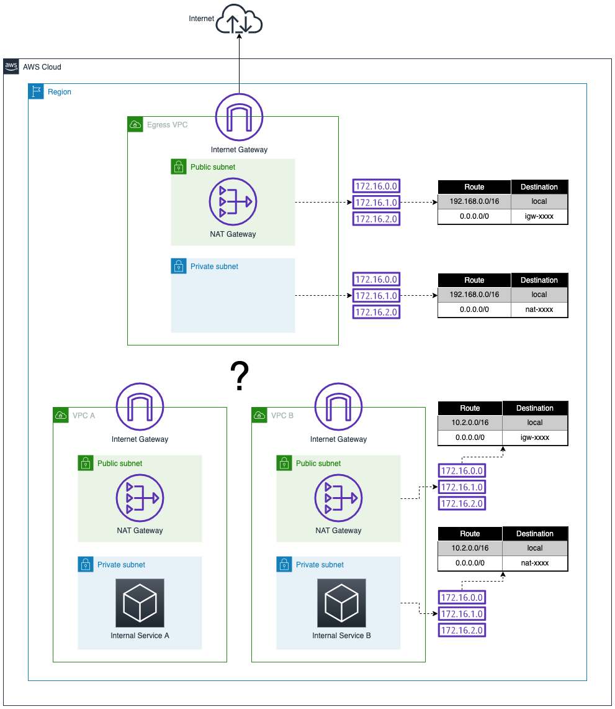

# Task 3: Routing - Configurando Transit Gateway e Roteamento

**Pontos Possíveis:** 75  
**Penalidade de Dica:** 0  
**Pontos Disponíveis:** 75  
**Check my progress:** Disponível

---

## ⚠️ AVISO: Esta é a Tarefa Mais Difícil do Desafio

Esta task é considerada a **mais complexa** devido à necessidade de configurar roteamento bidirecional entre múltiplas VPCs. Preste atenção especial aos detalhes de configuração das route tables.

---

## 📖 Background

Com a Egress VPC implantada, você agora pode projetar e implementar como o tráfego de Internet de saída das VPCs A e B será roteado para a Egress VPC, e como o tráfego de retorno volta novamente.

## 🎯 Sua Tarefa

Você precisa implantar um **Transit Gateway** para rotear o tráfego de Internet das VPCs A e B para a Egress VPC e para a Internet. O Transit Gateway precisará ser anexado às VPCs e rotas precisam ser colocadas no lugar para o tráfego de Internet de saída.

**Considere:**
- Quais sub-redes precisarão dos attachments?
- Quais rotas novas os serviços internos precisam para ter acesso à Internet?
- Como garantir que o tráfego de **retorno** chega ao destino correto?

## 📦 Inventário



### Arquitetura a ser Implementada

```
┌─────────────┐                    ┌─────────────┐
│   VPC A     │                    │   VPC B     │
│(10.1.0.0/16)│                    │(10.2.0.0/16)│
│             │                    │             │
│  Private    │                    │  Private    │
│  Subnet     │                    │  Subnet     │
└──────┬──────┘                    └──────┬──────┘
       │                                  │
       │ TGW Attachment                   │ TGW Attachment
       │                                  │
       └────────────┐          ┌──────────┘
                    │          │
                    ▼          ▼
           ┌──────────────────────────┐
           │    Transit Gateway       │
           │   (Hub de Roteamento)    │
           └───────────┬──────────────┘
                       │
                       │ TGW Attachment
                       ▼
           ┌──────────────────────────┐
           │     Egress VPC           │
           │   (10.200.0.0/16)        │
           ├──────────────────────────┤
           │  Private Subnet          │
           │      ↓                   │
           │  NAT Gateway (Public)    │
           │      ↓                   │
           │  Internet Gateway        │
           └──────────┬───────────────┘
                      │
                      ▼
                  Internet
```

## 🛠️ Serviços que Você Deve Usar

- **Transit Gateway**
- **Transit Gateway Attachments**
- **Transit Gateway Route Table**
- **VPC Route Tables**

### ⚠️ Observações Importantes

- Esta tarefa pode ser completada no console VPC adicionando novos recursos e mudando recursos existentes
- **Nenhum recurso existente deve ser deletado** — na próxima tarefa você limpará recursos que não são mais necessários
- O validador assume que a Egress VPC e seu NAT Gateway permanecem os mesmos da tarefa anterior

## ✅ Validação da Tarefa

**Insira o Transit Gateway ID** uma vez que todas as rotas estejam no lugar para checar a conectividade de Internet para recursos privados nas VPCs A e B.

---

## 💡 Solução Passo a Passo (Console AWS)

### 1️⃣ Criar o Transit Gateway

**Navegação:** AWS Console → **VPC** → **Transit Gateways** → **Create transit gateway**

**Configurações:**
```
Name: tgw-egress
Description: Transit Gateway for Egress VPC pattern
Amazon side ASN: (deixe padrão - 64512)
DNS support: Enable ✅
VPN ECMP support: Enable (opcional)
Default route table association: Enable ✅ (facilita)
Default route table propagation: Enable ✅ (facilita)
Multicast support: Disable
Auto accept shared attachments: Disable
```

**Ações:**
1. Preencha os campos
2. Clique em **"Create transit gateway"**
3. **Anote o Transit Gateway ID** (tgw-xxxxxxxxx)
4. **Aguarde** o estado mudar de `Pending` para `Available` (~1-2 minutos)

> ⏱️ **Tempo de espera:** O TGW leva de 30 segundos a 2 minutos para ficar disponível. **NÃO prossiga** até o status estar `Available`.

### 2️⃣ Criar os Transit Gateway Attachments

Você precisará criar **3 attachments** (um para cada VPC).

> ⚠️ **IMPORTANTE:** Use sempre as **subnets PRIVADAS** para os attachments!

**Navegação:** VPC → **Transit Gateway attachments** → **Create transit gateway attachment**

#### Attachment - VPC A

**Configurações:**
```
Name: tgw-att-vpc-a
Transit gateway ID: tgw-egress (selecione o criado)
Attachment type: VPC
DNS support: Enable
IPv6 support: Disable

VPC ID: vpc-xxxxxx (VPC A - 10.1.0.0/16)
Subnet IDs: Selecione APENAS a subnet PRIVADA da VPC A na AZ do lab ✅
```

**Ações:**
1. Preencha os campos
2. **ATENÇÃO:** Selecione a subnet **privada** (onde está o Internal Service)
3. Clique em **"Create transit gateway attachment"**
4. Aguarde status `Available` (~30-60 segundos)

#### Attachment - VPC B

**Configurações:**
```
Name: tgw-att-vpc-b
Transit gateway ID: tgw-egress
Attachment type: VPC
DNS support: Enable

VPC ID: vpc-xxxxxx (VPC B - 10.2.0.0/16)
Subnet IDs: Selecione APENAS a subnet PRIVADA da VPC B na AZ do lab ✅
```

**Ações:**
1. Preencha os campos
2. **ATENÇÃO:** Selecione a subnet **privada**
3. Clique em **"Create transit gateway attachment"**
4. Aguarde status `Available`

#### Attachment - Egress VPC

**Configurações:**
```
Name: tgw-att-egress
Transit gateway ID: tgw-egress
Attachment type: VPC
DNS support: Enable

VPC ID: vpc-xxxxxx (Egress VPC - 10.200.0.0/16)
Subnet IDs: Selecione a subnet PRIVADA da Egress VPC ✅
            (a que tem rota 0.0.0.0/0 → NAT)
```

**Ações:**
1. Preencha os campos
2. **ATENÇÃO:** Selecione a subnet **privada** (egress-private-subnet)
3. Clique em **"Create transit gateway attachment"**
4. Aguarde todos os 3 attachments ficarem `Available`

### 3️⃣ Configurar Transit Gateway Route Table

**Navegação:** VPC → **Transit Gateway route tables**

> 💡 Se você habilitou "Default route table association/propagation", o TGW já criou uma route table automaticamente.

#### Verificar/Configurar Associations

**Ações:**
1. Selecione a route table do TGW
2. Aba **"Associations"**
3. Verifique se os 3 attachments estão associados:
   - `tgw-att-vpc-a` ✅
   - `tgw-att-vpc-b` ✅
   - `tgw-att-egress` ✅

Se não estiverem, clique em **"Create association"** para cada um.

#### Verificar/Configurar Propagations

**Ações:**
1. Aba **"Propagations"**
2. Verifique se os 3 attachments estão propagando:
   - `tgw-att-vpc-a` ✅
   - `tgw-att-vpc-b` ✅
   - `tgw-att-egress` ✅

Se não estiverem, clique em **"Create propagation"** para cada um.

> 💡 Com propagations ativas, o TGW aprende automaticamente as rotas `10.1.0.0/16`, `10.2.0.0/16` e `10.200.0.0/16`.

#### Criar Rota Estática para Internet

**Ações:**
1. Aba **"Routes"** → **"Create static route"**
2. **CONFIGURAÇÃO CRÍTICA:**
   ```
   CIDR: 0.0.0.0/0
   Attachment: tgw-att-egress (Egress VPC attachment) ⚠️
   ```
3. Clique em **"Create static route"**

**Resultado esperado na route table do TGW:**
```
CIDR              Attachment          Type
─────────────────────────────────────────────────
10.1.0.0/16       tgw-att-vpc-a       Propagated ✅
10.2.0.0/16       tgw-att-vpc-b       Propagated ✅
10.200.0.0/16     tgw-att-egress      Propagated ✅
0.0.0.0/0         tgw-att-egress      Static ✅
```

### 4️⃣ Atualizar Route Tables das VPCs A e B (Subnets Privadas)

> ⚠️ **IMPORTANTE:** Modifique APENAS as route tables das subnets privadas. NÃO delete nada!

#### VPC A - Private Route Table

**Navegação:** VPC → **Route Tables** → Encontre a RT privada da VPC A

**Identificação:** A RT que está associada à subnet privada da VPC A (onde está o Internal Service A)

**Ações:**
1. Selecione a route table
2. Aba **"Routes"** → **"Edit routes"**
3. **Add route:**
   ```
   Destination: 0.0.0.0/0
   Target: Transit Gateway → tgw-egress ⚠️
   ```
4. **Save changes**

**Resultado esperado:**
```
Destination      Target
───────────────────────────────
10.1.0.0/16      local
0.0.0.0/0        tgw-xxxxxxxxx ✅
```

> 💡 A rota antiga para o NAT local permanece, mas não será mais usada (será removida na Task 4).

#### VPC B - Private Route Table

**Mesmo processo para VPC B:**

**Ações:**
1. Encontre a RT privada da VPC B
2. **Edit routes** → **Add route:**
   ```
   Destination: 0.0.0.0/0
   Target: Transit Gateway → tgw-egress
   ```
3. **Save changes**

**Resultado esperado:**
```
Destination      Target
───────────────────────────────
10.2.0.0/16      local
0.0.0.0/0        tgw-xxxxxxxxx ✅
```

### 5️⃣ Atualizar Route Tables da Egress VPC

> 🔥 **ESTE É O PASSO MAIS CRÍTICO E ONDE A MAIORIA ERRA!**

A Egress VPC precisa de rotas de **retorno** para que o tráfego volte às VPCs A e B após passar pelo NAT.

#### Egress VPC - Private Route Table

**Navegação:** VPC → **Route Tables** → Encontre `egress-private-rt`

**Identificação:** A RT que está associada à `egress-private-subnet` (tem rota 0.0.0.0/0 → NAT)

**Ações:**
1. Selecione a route table
2. Aba **"Routes"** → **"Edit routes"**
3. **VERIFIQUE** que a rota para NAT existe:
   ```
   ❌ SE EXISTIR: 0.0.0.0/0 → Transit Gateway
   👉 REMOVA ESTA ROTA! Ela está errada!
   ```
4. **GARANTA** que a rota correta existe:
   ```
   ✅ 0.0.0.0/0 → NAT Gateway (nat-xxxxxx)
   ```
5. **Add route** para VPC A:
   ```
   Destination: 10.1.0.0/16
   Target: Transit Gateway → tgw-egress ⚠️
   ```
6. **Add route** para VPC B:
   ```
   Destination: 10.2.0.0/16
   Target: Transit Gateway → tgw-egress ⚠️
   ```
7. **Save changes**

**Resultado esperado (CRÍTICO):**
```
Destination      Target
────────────────────────────────────────
10.200.0.0/16    local ✅
0.0.0.0/0        nat-xxxxxxxxx ✅ (NAT, NÃO TGW!)
10.1.0.0/16      tgw-xxxxxxxxx ✅ (retorno para VPC A)
10.2.0.0/16      tgw-xxxxxxxxx ✅ (retorno para VPC B)
```

> ⚠️ **ERRO COMUM:** Colocar `0.0.0.0/0 → TGW` em vez de `0.0.0.0/0 → NAT`. Isso quebra completamente o fluxo!

#### Egress VPC - Public Route Table

**Navegação:** VPC → **Route Tables** → Encontre `egress-public-rt`

**Identificação:** A RT que está associada à `egress-public-subnet` (onde está o NAT Gateway)

**Ações:**
1. Selecione a route table
2. Aba **"Routes"** → **"Edit routes"**
3. **Add route** para VPC A:
   ```
   Destination: 10.1.0.0/16
   Target: Transit Gateway → tgw-egress ⚠️
   ```
4. **Add route** para VPC B:
   ```
   Destination: 10.2.0.0/16
   Target: Transit Gateway → tgw-egress ⚠️
   ```
5. **Save changes**

**Resultado esperado (TAMBÉM CRÍTICO):**
```
Destination      Target
────────────────────────────────────────
10.200.0.0/16    local ✅
0.0.0.0/0        igw-xxxxxxxxx ✅ (Internet Gateway)
10.1.0.0/16      tgw-xxxxxxxxx ✅ (retorno para VPC A)
10.2.0.0/16      tgw-xxxxxxxxx ✅ (retorno para VPC B)
```

> 🔥 **POR QUE ISSO É NECESSÁRIO:** O NAT Gateway fica na subnet pública e usa a route table pública para enviar pacotes de retorno. Sem essas rotas, os pacotes de resposta tentam sair pela Internet em vez de voltar ao TGW!

### 6️⃣ Validar Conectividade

**Ações:**
1. Copie o **Transit Gateway ID** (tgw-xxxxxxxxx)
2. No lab, clique em **"Check my progress"**
3. Cole o Transit Gateway ID
4. Aguarde validação

**Mensagens possíveis:**

✅ **Sucesso:**
```
Service in VPC A successfully connected to internet via egress NAT.
Service in VPC B successfully connected to internet via egress NAT.
```

❌ **Erro:**
```
Service in VPC A did not connect to internet via egress NAT. 
Check your outgoing and return traffic routes.
```

Se receber erro, vá para a seção de Troubleshooting abaixo.

---

## 🚨 Troubleshooting Detalhado

### 🔴 Erro: "Service in VPC A did not connect to internet via egress NAT"

Este erro indica que o tráfego não está fluindo corretamente. Vamos diagnosticar sistematicamente.

#### 📋 Checklist Completo de Diagnóstico

##### ✅ 1. VPC A - Private Route Table

**Verificar:**
```
Destination      Target          Status
─────────────────────────────────────────
10.1.0.0/16      local           Active ✅
0.0.0.0/0        tgw-xxxxxxxxx   Active ✅
```

**Como verificar:**
1. VPC → Route Tables
2. Encontre a RT com `Explicit subnet associations` = subnet privada da VPC A
3. Aba "Routes"

**Se estiver errado:**
- Se tiver `0.0.0.0/0 → nat-xxxxxxx`, troque para TGW
- **Edit routes** → Modifique a rota

##### ✅ 2. VPC B - Private Route Table

**Verificar:** (mesmo processo da VPC A)
```
Destination      Target          Status
─────────────────────────────────────────
10.2.0.0/16      local           Active ✅
0.0.0.0/0        tgw-xxxxxxxxx   Active ✅
```

##### ✅ 3. Transit Gateway - Route Table

**Verificar:**
```
CIDR             Attachment           Type
────────────────────────────────────────────────
10.1.0.0/16      tgw-att-vpc-a        Propagated ✅
10.2.0.0/16      tgw-att-vpc-b        Propagated ✅
10.200.0.0/16    tgw-att-egress       Propagated ✅
0.0.0.0/0        tgw-att-egress       Static ✅
```

**Como verificar:**
1. VPC → Transit Gateway route tables
2. Selecione a route table
3. Aba "Routes"

**Problema comum:** Falta a rota `0.0.0.0/0 → tgw-att-egress (Static)`

**Solução:**
- Aba "Routes" → "Create static route"
- CIDR: `0.0.0.0/0`
- Attachment: selecione o attachment da Egress VPC
- Create

##### ✅ 4. Transit Gateway - Associations

**Verificar:**
1. Aba "Associations"
2. Os 3 attachments devem estar listados:
   - tgw-att-vpc-a ✅
   - tgw-att-vpc-b ✅
   - tgw-att-egress ✅

**Se faltar algum:**
- "Create association" → Selecione o attachment faltante

##### ✅ 5. Transit Gateway - Propagations

**Verificar:**
1. Aba "Propagations"
2. Os 3 attachments devem estar propagando:
   - tgw-att-vpc-a ✅
   - tgw-att-vpc-b ✅
   - tgw-att-egress ✅

**Se faltar algum:**
- "Create propagation" → Selecione o attachment faltante

##### ✅ 6. Egress VPC - Private Route Table (CRÍTICO!)

**Verificar:**
```
Destination      Target          Status
─────────────────────────────────────────
10.200.0.0/16    local           Active ✅
0.0.0.0/0        nat-xxxxxxxxx   Active ✅ (NAT, NÃO TGW!)
10.1.0.0/16      tgw-xxxxxxxxx   Active ✅
10.2.0.0/16      tgw-xxxxxxxxx   Active ✅
```

**🔥 ERRO MAIS COMUM:**
Se você ver `0.0.0.0/0 → tgw-xxxxxxxxx`, **está errado!**

**Solução:**
1. Edit routes
2. **Delete** a rota `0.0.0.0/0 → TGW`
3. **Add route:** `0.0.0.0/0 → NAT Gateway` (nat-xxxxxx)
4. Verifique que `10.1/16 → TGW` e `10.2/16 → TGW` existem
5. Save changes

**Por quê:** Esta subnet é onde o attachment do TGW está. O tráfego chega aqui do TGW e precisa ir para o NAT (que está na subnet pública) antes de sair para a Internet.

##### ✅ 7. Egress VPC - Public Route Table (TAMBÉM CRÍTICO!)

**Verificar:**
```
Destination      Target          Status
─────────────────────────────────────────
10.200.0.0/16    local           Active ✅
0.0.0.0/0        igw-xxxxxxxxx   Active ✅
10.1.0.0/16      tgw-xxxxxxxxx   Active ✅
10.2.0.0/16      tgw-xxxxxxxxx   Active ✅
```

**Problema comum:** Faltam as rotas `10.1/16` e `10.2/16` apontando para TGW

**Por quê:** O NAT Gateway fica nesta subnet. Quando os pacotes retornam da Internet, eles chegam via IGW → NAT → e precisam ser enviados de volta ao TGW. Sem essas rotas, o NAT não sabe para onde enviar os pacotes destinados a `10.1.x.x` ou `10.2.x.x`.

**Solução:**
1. Edit routes
2. Add route: `10.1.0.0/16 → Transit Gateway`
3. Add route: `10.2.0.0/16 → Transit Gateway`
4. Save changes

##### ✅ 8. Attachments - Subnet Correta

**Verificar:**
1. VPC → Transit Gateway attachments
2. Para cada attachment, verifique:
   - VPC A: attachment na subnet **privada** ✅
   - VPC B: attachment na subnet **privada** ✅
   - Egress: attachment na subnet **privada** ✅

**Se estiver na subnet errada:**
- Delete o attachment
- Recrie apontando para a subnet privada

##### ✅ 9. Attachments - Status

**Verificar:**
1. Todos os 3 attachments devem estar `Available`
2. Se estiverem `Pending`, aguarde 1-2 minutos

---

## 📊 Fluxo de Tráfego Completo

### 🟢 Caminho de Saída (Outbound)

```
1. Internal Service em VPC A (10.1.x.x)
   └─► Quer acessar 8.8.8.8 (Internet)
       
2. Consulta route table privada da VPC A
   └─► 0.0.0.0/0 → TGW ✅
       
3. Chega no Transit Gateway
   └─► Consulta TGW route table
       └─► 0.0.0.0/0 → tgw-att-egress ✅
           
4. TGW envia para Egress VPC (subnet privada)
   └─► Consulta egress-private-rt
       └─► 0.0.0.0/0 → NAT Gateway ✅
           
5. Pacote vai para subnet pública (onde está NAT)
   └─► NAT traduz IP origem (10.1.x.x → IP público do NAT)
       
6. NAT consulta egress-public-rt
   └─► 0.0.0.0/0 → IGW ✅
       
7. Internet Gateway envia para Internet
   └─► Pacote chega em 8.8.8.8 ✅
```

### 🔵 Caminho de Retorno (Inbound)

```
1. Resposta da Internet (de 8.8.8.8)
   └─► Destino: IP público do NAT Gateway
       
2. Internet Gateway recebe
   └─► Encaminha para NAT Gateway (subnet pública)
       
3. NAT traduz destino (IP público → 10.1.x.x original)
   └─► Pacote agora tem destino 10.1.x.x
       
4. NAT consulta egress-public-rt
   └─► 10.1.0.0/16 → TGW ✅ (ROTA DE RETORNO CRÍTICA!)
       
5. Pacote vai para Transit Gateway
   └─► TGW consulta sua route table
       └─► 10.1.0.0/16 → tgw-att-vpc-a ✅ (propagated)
           
6. TGW envia para VPC A (subnet privada)
   └─► Pacote chega no Internal Service ✅
```

### ❌ O Que Acontece Sem as Rotas de Retorno

**Se faltar `10.1/16 → TGW` na egress-public-rt:**

```
1-3. [Mesmo caminho de saída, OK até o NAT traduzir]
    
4. NAT traduz destino para 10.1.x.x
   └─► Consulta egress-public-rt
       └─► Não encontra rota para 10.1.0.0/16
           └─► Usa rota padrão: 0.0.0.0/0 → IGW
               └─► Tenta enviar 10.1.x.x para Internet ❌
                   └─► Internet rejeita (IP privado) ❌
                       └─► Pacote é descartado ❌
```

**Resultado:** Conexão trava, timeout, validador falha!

---

## 📝 Resumo da Conversa com ChatGPT (Depuração)

Durante a resolução deste desafio, foi necessário usar o ChatGPT para depurar problemas de conectividade. Aqui está um resumo dos principais pontos:

### 🔴 Problema Principal

**Erro:** "Service in VPC A did not connect to internet via egress NAT"

### 🔍 Diagnóstico

1. **Primeira verificação:** Routes das VPCs A e B estavam corretas
2. **Segunda verificação:** Transit Gateway route table OK
3. **Terceira verificação:** Descobriu-se que a **Egress Private RT** tinha `0.0.0.0/0 → TGW` em vez de `0.0.0.0/0 → NAT`
4. **Quarta verificação:** Mesmo após correção, ainda falhava
5. **Quinta verificação:** **FALTAVAM as rotas de retorno na Public RT!**

### ✅ Solução Final

**Egress VPC - Private RT:**
- ❌ **REMOVER:** `0.0.0.0/0 → TGW`
- ✅ **MANTER:** `0.0.0.0/0 → NAT Gateway`
- ✅ **ADICIONAR:** `10.1.0.0/16 → TGW`
- ✅ **ADICIONAR:** `10.2.0.0/16 → TGW`

**Egress VPC - Public RT:**
- ✅ **MANTER:** `0.0.0.0/0 → IGW`
- ✅ **ADICIONAR:** `10.1.0.0/16 → TGW` ← **Esta era a chave!**
- ✅ **ADICIONAR:** `10.2.0.0/16 → TGW` ← **Esta também!**

### 💡 Lição Aprendida

O NAT Gateway precisa de **duas route tables configuradas corretamente:**

1. **Private RT** (onde o TGW attachment está):
   - Envia tráfego de saída para o NAT
   - Retorna tráfego das VPCs A/B para o TGW

2. **Public RT** (onde o NAT Gateway está):
   - Envia tráfego de saída para Internet via IGW
   - **Retorna tráfego das VPCs A/B para o TGW** ← Esquecido com frequência!

O erro não estava nas rotas de ida, mas nas **rotas de retorno** da subnet pública!

---

## 🎯 Checklist Final Antes de Validar

```
[ ] Transit Gateway criado e Available
[ ] 3 Attachments criados, todos Available
[ ] Attachments em subnets PRIVADAS
[ ] TGW RT: Associations configuradas (3 attachments)
[ ] TGW RT: Propagations configuradas (3 attachments)
[ ] TGW RT: Rota 0.0.0.0/0 → Egress attachment (STATIC)
[ ] VPC A Private RT: 0.0.0.0/0 → TGW
[ ] VPC B Private RT: 0.0.0.0/0 → TGW
[ ] Egress Private RT: 0.0.0.0/0 → NAT (NÃO TGW!)
[ ] Egress Private RT: 10.1/16 → TGW
[ ] Egress Private RT: 10.2/16 → TGW
[ ] Egress Public RT: 0.0.0.0/0 → IGW
[ ] Egress Public RT: 10.1/16 → TGW ⚠️
[ ] Egress Public RT: 10.2/16 → TGW ⚠️
[ ] NAT Gateway Available
[ ] Internet Gateway Attached
```

---

## 🏆 Validação com Sucesso

Se tudo estiver correto, ao submeter o Transit Gateway ID, você deve ver:

```
✅ Task 3 completed successfully!

Service in VPC A vpc-xxxxxxxxx successfully connected to internet via egress NAT.
Service in VPC B vpc-xxxxxxxxx successfully connected to internet via egress NAT.

Points awarded: 75
```

**Parabéns! 🎉** Você configurou com sucesso uma arquitetura complexa de múltiplas VPCs com Transit Gateway!

---

**Próximo passo:** Task 4 - Otimizar removendo recursos desnecessários! ✂️
