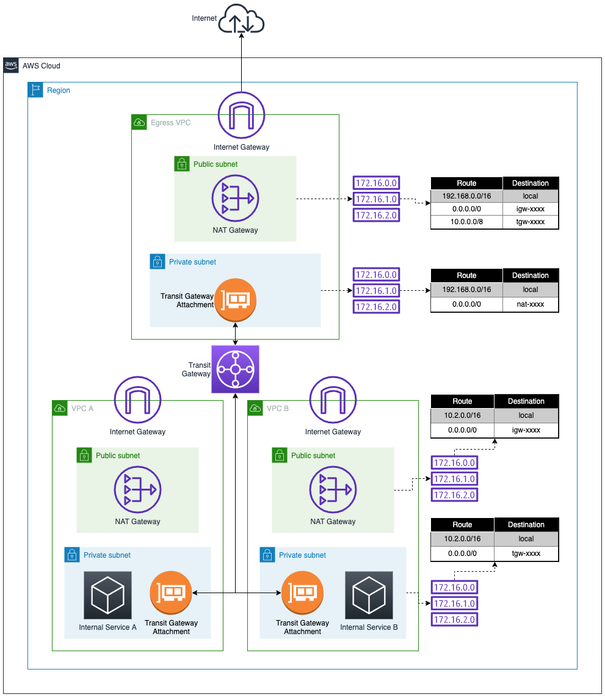

# Task 4: Optimize - Limpeza e Otimização

**Pontos Possíveis:** 30  
**Penalidade de Dica:** 0  
**Pontos Disponíveis:** 30  
**Check my progress:** Disponível

---

## 📖 Background

Você ainda não terminou completamente! Agora podemos simplificar a arquitetura das VPCs de serviço A e B. Considere quais recursos não são mais necessários e podem ser deletados para **reduzir a superfície de ataque** e **reduzir custos**.

## 🎯 Sua Tarefa

Revisar a arquitetura atual, identificar recursos que não são mais necessários nas VPCs A e B, e deletá-los.

## 📦 Inventário



### Arquitetura Atual vs. Desejada

#### ❌ Antes (Recursos Redundantes)

```
┌─────────────────────────────┐
│         VPC A               │
├─────────────────────────────┤
│  ❌ Public Subnet           │
│     - NAT Gateway ← CARO    │
│     - Public RT             │
│  ❌ Internet Gateway         │
│                             │
│  ✅ Private Subnet           │
│     - Internal Service      │
│     - Route: 0.0.0.0/0→TGW  │
└─────────────────────────────┘
```

#### ✅ Depois (Otimizado)

```
┌─────────────────────────────┐
│         VPC A               │
├─────────────────────────────┤
│  ✅ Private Subnet APENAS    │
│     - Internal Service      │
│     - Route: 0.0.0.0/0→TGW  │
└─────────────────────────────┘
```

## 🗑️ Recursos que Devem Ser Removidos

### 📋 Lista Completa (Para Cada VPC A e B)

1. **NAT Gateway** ← Maior economia de custo (~$32/mês cada)
2. **Elastic IP** associado ao NAT Gateway
3. **Internet Gateway**
4. **Sub-rede pública**
5. **Route table pública** e suas associações

### 💰 Economia de Custos

**Por VPC:**
- NAT Gateway: ~$32/mês
- Elastic IP (quando não associado): ~$3.60/mês
- Data processing do NAT: variável

**Total (2 VPCs):**
- Economia imediata: **~$64/mês** apenas removendo NAT Gateways!
- Mais economia no data processing

### 🔒 Redução de Superfície de Ataque

- ✅ Menos Internet Gateways para monitorar
- ✅ Menos pontos de saída para Internet
- ✅ Menos sub-redes públicas
- ✅ Arquitetura mais simples = mais fácil de auditar

## 🛠️ Serviços que Você Deve Usar

- **VPC Internet Gateway** (deletar)
- **VPC Subnets** (deletar públicas)
- **VPC Route Tables** (deletar públicas)
- **NAT Gateways** (deletar)

## ✅ Validação da Tarefa

O botão **"Check my progress"** continuará monitorando a conectividade dos serviços para a Egress VPC para alertá-lo sobre quaisquer mudanças que impactem sua conectividade.

Uma vez que você tenha removido todos os recursos que não são mais necessários, pressionar o botão **"Check my progress"** completará a tarefa.

### ⚠️ Observações Importantes

- O validador assume que a Egress VPC, o Egress NAT Gateway e o Transit Gateway permanecem os mesmos da tarefa anterior
- Você pode ignorar avisos sobre `ram:GetResourceShareAssociations`
- Recursos como NAT Gateways levam um tempo para deletar, então você pode precisar aguardar antes de deletar outros recursos

---

## 🧹 Solução Passo a Passo - Ordem Segura de Deleção

> ⚠️ **IMPORTANTE:** Faça EXATAMENTE nesta ordem para evitar bloqueios e erros!

Repita este processo para **VPC A** e depois para **VPC B**.

### 1️⃣ Garantir que Roteamento Está Correto

**ANTES de deletar qualquer coisa**, confirme que a conectividade via TGW está funcionando:

**VPC A - Private Route Table deve ter:**
```
Destination      Target
───────────────────────────
10.1.0.0/16      local ✅
0.0.0.0/0        tgw-xxxxxxxxx ✅ (NÃO o NAT local!)
```

**VPC B - Private Route Table deve ter:**
```
Destination      Target
───────────────────────────
10.2.0.0/16      local ✅
0.0.0.0/0        tgw-xxxxxxxxx ✅ (NÃO o NAT local!)
```

> 💡 Se ainda houver rotas para NAT Gateways locais, elas não são mais usadas (rota mais específica para TGW tem precedência), mas não as delete ainda.

### 2️⃣ Deletar NAT Gateway (VPC A)

**Navegação:** VPC → **NAT Gateways**

**Ações:**
1. Filtre por VPC A (vpc-xxxxxx)
2. Selecione o NAT Gateway da VPC A
3. **Actions** → **Delete NAT gateway**
4. Digite `delete` para confirmar
5. Delete

⏱️ **Aguarde:** O NAT leva de **1 a 3 minutos** para o estado mudar de `Deleting` para `Deleted`. **Não prossiga** até completar!

**Como monitorar:**
- Atualize a página periodicamente
- Quando desaparecer da lista ou ficar `Deleted`, prossiga

### 3️⃣ Release do Elastic IP (VPC A)

**Navegação:** VPC → **Elastic IPs**

**Ações:**
1. Encontre o EIP que estava associado ao NAT da VPC A
   - **Associated instance ID:** Deve estar vazio agora
   - Verifique pelo nome ou pela VPC
2. Selecione o EIP
3. **Actions** → **Release Elastic IP addresses**
4. Confirme

> 💡 Se o EIP ainda aparecer como associado, o NAT ainda não terminou de deletar. Aguarde mais um pouco.

### 4️⃣ Deletar Internet Gateway (VPC A)

**Navegação:** VPC → **Internet Gateways**

**Ações:**
1. Encontre o IGW da VPC A
2. **PRIMEIRO: Detach from VPC**
   - Selecione o IGW
   - **Actions** → **Detach from VPC**
   - Confirme
3. **DEPOIS: Delete**
   - Selecione o IGW
   - **Actions** → **Delete internet gateway**
   - Digite `delete` para confirmar
   - Delete

### 5️⃣ Deletar Sub-rede Pública (VPC A)

**Navegação:** VPC → **Subnets**

**Ações:**
1. Encontre a subnet pública da VPC A
   - **Hint:** Geralmente tem "public" no nome
   - **Ou:** Verifique qual subnet tinha o NAT Gateway
2. Selecione a subnet
3. **Actions** → **Delete subnet**
4. Digite `delete` para confirmar
5. Delete

**Possível erro:** "Network interface still attached"

**Solução:**
- O NAT pode ter deixado uma ENI (Elastic Network Interface) órfã
- VPC → **Network Interfaces**
- Encontre ENIs sem attachment na subnet pública
- Delete manualmente
- Tente deletar a subnet novamente

### 6️⃣ Deletar Route Table Pública (VPC A)

**Navegação:** VPC → **Route Tables**

**Ações:**
1. Encontre a route table pública da VPC A
   - **Hint:** Tinha rota `0.0.0.0/0 → IGW` (agora sem target após deletar IGW)
   - **Hint:** Tinha associação com a subnet pública (agora deletada)
2. Selecione a route table
3. **Actions** → **Delete route table**
4. Confirme

**Possível erro:** "Route table has dependencies"

**Solução:**
- Verifique a aba **"Subnet associations"**
- Se houver associações, remova-as primeiro
- Tente deletar novamente

### 7️⃣ Repetir Para VPC B

Repita os passos 2️⃣ a 6️⃣ para a **VPC B**, na mesma ordem:

```
1. Delete NAT Gateway da VPC B
2. Aguarde deleção completa
3. Release Elastic IP da VPC B
4. Detach e Delete Internet Gateway da VPC B
5. Delete subnet pública da VPC B
6. Delete route table pública da VPC B
```

### 8️⃣ Validar Limpeza e Conectividade

**Ações:**
1. Clique em **"Check my progress"** no lab
2. O validador irá:
   - ✅ Confirmar que recursos desnecessários foram removidos
   - ✅ Verificar que conectividade via Egress VPC continua funcionando
   - ✅ Validar que o padrão Egress VPC está completo

**Mensagem de sucesso esperada:**
```
✅ Task 4 completed successfully!

Services in VPC A and B are still connected to internet via egress NAT.
Unnecessary resources have been removed.
Cost optimization achieved!

Points awarded: 30
```

---

## 🔍 Checklist de Verificação

### ❌ Recursos que DEVEM SER REMOVIDOS

#### VPC A
- [ ] NAT Gateway deletado
- [ ] Elastic IP released
- [ ] Internet Gateway detached e deletado
- [ ] Subnet pública deletada
- [ ] Route table pública deletada

#### VPC B
- [ ] NAT Gateway deletado
- [ ] Elastic IP released
- [ ] Internet Gateway detached e deletado
- [ ] Subnet pública deletada
- [ ] Route table pública deletada

### ✅ Recursos que DEVEM PERMANECER

#### VPC A
- [x] Subnet privada
- [x] Route table privada (com 0.0.0.0/0 → TGW)
- [x] Internal Service (instância/recurso)
- [x] Transit Gateway attachment

#### VPC B
- [x] Subnet privada
- [x] Route table privada (com 0.0.0.0/0 → TGW)
- [x] Internal Service (instância/recurso)
- [x] Transit Gateway attachment

#### Egress VPC (NADA MUDA!)
- [x] Todas as subnets (pública e privada)
- [x] NAT Gateway
- [x] Internet Gateway
- [x] Route tables (pública e privada)
- [x] Transit Gateway attachment

#### Transit Gateway (NADA MUDA!)
- [x] Transit Gateway
- [x] Route table do TGW
- [x] Todos os 3 attachments
- [x] Todas as rotas configuradas

---

## 🚨 Troubleshooting

### Problema: Não consigo deletar o NAT Gateway

**Erro comum:** "Cannot delete NAT gateway because it has dependent objects"

**Solução:**
1. Não há objetos dependentes para NAT Gateway
2. Simplesmente selecione e delete
3. Se realmente bloqueado, verifique se há alguma rota específica apontando para ele que deveria ter sido modificada

### Problema: Não consigo deletar a subnet pública

**Erro comum:** "Network interface still attached"

**Solução detalhada:**
1. VPC → **Network Interfaces**
2. Filtrar por VPC A (ou B)
3. Procure por ENIs (Elastic Network Interfaces) com:
   - Status: `Available` (não attached)
   - Description: Pode mencionar "NAT Gateway"
   - Subnet: A subnet pública que você está tentando deletar
4. Selecione essas ENIs órfãs
5. **Actions** → **Delete**
6. Retorne e tente deletar a subnet novamente

### Problema: Não consigo deletar o Internet Gateway

**Erro comum:** "Gateway is attached to VPC"

**Solução:**
1. Você DEVE detach antes de deletar
2. VPC → Internet Gateways
3. Selecione o IGW
4. **Actions** → **Detach from VPC**
5. Confirme
6. **DEPOIS** Actions → **Delete internet gateway**

### Problema: Validador diz que recursos ainda existem

**Possíveis causas:**
1. Estado de deleção ainda não propagou (aguarde 30-60 segundos)
2. Deletou recursos da VPC errada
3. Elastic IP não foi released

**Solução:**
1. Aguarde 1 minuto
2. Verifique cada VPC individualmente
3. Confirme que NAT Gateways estão `Deleted` (não apenas `Deleting`)
4. Confirme que Elastic IPs foram released

### Problema: Validador diz que conectividade foi perdida

**Possíveis causas:**
1. Você deletou algo que não deveria (subnet privada, attachment do TGW)
2. Você modificou rotas incorretamente

**Solução:**
1. Verifique que subnets privadas ainda existem
2. Verifique que attachments do TGW ainda existem e estão `Available`
3. Verifique routes tables privadas ainda têm `0.0.0.0/0 → TGW`
4. Se deletou algo crítico, você terá que recriar

---

## 📊 Arquitetura Final Otimizada

```
┌─────────────┐                    ┌─────────────┐
│   VPC A     │                    │   VPC B     │
│(10.1.0.0/16)│                    │(10.2.0.0/16)│
│             │                    │             │
│  Private    │                    │  Private    │
│  Subnet     │                    │  Subnet     │
│  APENAS     │                    │  APENAS     │
└──────┬──────┘                    └──────┬──────┘
       │                                  │
       │ TGW Attachment                   │ TGW Attachment
       │                                  │
       └────────────┐          ┌──────────┘
                    │          │
                    ▼          ▼
           ┌──────────────────────────┐
           │    Transit Gateway       │
           │   (Hub Centralizado)     │
           └───────────┬──────────────┘
                       │
                       │ TGW Attachment
                       ▼
           ┌──────────────────────────────┐
           │     Egress VPC               │
           │   (10.200.0.0/16)            │
           ├──────────────────────────────┤
           │                              │
           │  Private Subnet              │
           │    (TGW attachment)          │
           │         ↓                    │
           │  ┌────────────────────┐     │
           │  │  Public Subnet     │     │
           │  │  • NAT Gateway ✅  │     │
           │  │  • IGW ✅          │     │
           │  └───────────┬────────┘     │
           └──────────────┼──────────────┘
                          │
                          ▼
                      Internet
          (Ponto único de saída ✅)
```

### 🎯 Benefícios Alcançados

**✅ Custo:**
- Redução de ~$64/mês (2 NAT Gateways removidos)
- Redução de custos de data processing
- Redução de custos de Elastic IPs

**✅ Segurança:**
- Superfície de ataque reduzida
- Apenas 1 ponto de saída (Egress VPC)
- Monitoramento centralizado
- Auditoria simplificada

**✅ Operacional:**
- Menos recursos para gerenciar
- Arquitetura mais simples
- Menos pontos de falha
- Conformidade mais fácil

---

## 🏆 Desafio Completo!

Ao completar esta tarefa, você terá:

- ✅ **Task 1 (15 pts):** Identificado o padrão Egress VPC
- ✅ **Task 2 (30 pts):** Criado a Egress VPC com todos os recursos
- ✅ **Task 3 (75 pts):** Configurado Transit Gateway e roteamento complexo
- ✅ **Task 4 (30 pts):** Otimizado a arquitetura removendo recursos desnecessários

**Total: 150 pontos! 🎉**

---

## 🎓 Lições Aprendidas

### 1. Ordem de Deleção Importa
- NAT Gateway → Elastic IP → Internet Gateway → Subnet → Route Table
- Deletar fora de ordem causa bloqueios e erros

### 2. Estados Transitórios
- NAT Gateway leva tempo para deletar
- Aguarde estados finais antes de prosseguir

### 3. Dependências Ocultas
- ENIs (Elastic Network Interfaces) podem ficar órfãs
- Sempre verifique network interfaces ao deletar subnets

### 4. Validação Contínua
- Use "Check my progress" frequentemente
- Valide conectividade antes e depois de mudanças
- Confirme que não quebrou nada

### 5. Documentação
- Mantenha lista de recursos deletados
- Documente IDs para referência
- Facilita troubleshooting se algo der errado

---

## 💡 Aplicação em Produção

### Antes de Deletar em Produção, Sempre:

1. **Backup de Configurações**
   - Exporte configurações de route tables
   - Documente todos os resources IDs
   - Tire screenshots da arquitetura atual

2. **Teste em Janela de Manutenção**
   - Programe para horário de baixo tráfego
   - Comunique equipes afetadas
   - Tenha plano de rollback

3. **Monitore Proativamente**
   - Configure alarmes CloudWatch antes
   - Monitore logs de fluxo VPC
   - Valide conectividade de aplicações

4. **Delete Gradualmente**
   - Uma VPC por vez
   - Aguarde validação entre cada passo
   - Não apresse o processo

5. **Mantenha Recursos Críticos**
   - Elastic IPs de produção podem ter custos ao re-alocar
   - Considere manter alguns por período de transição
   - Valide com equipe de rede

---

**🎉 Parabéns por completar este desafio complexo de networking na AWS!**

> **💭 Reflexão:** Você agora domina um dos padrões arquiteturais mais importantes para ambientes enterprise na AWS. Este conhecimento é essencial para arquitetos cloud sênior e frequentemente aparece em implementações reais de grande escala.
